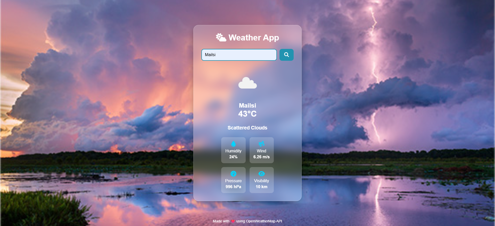

🌤 Weather App

A simple and responsive Weather App built with **HTML, CSS, and JavaScript** that fetches real-time weather data using the **OpenWeatherMap API**.

 📸 Preview

> Add a screenshot of your application and name it `screenshot.png`.

---

✨ Features

- 🔍 Search weather by city name

- 🌡️ Real-time temperature

- ☁️ Weather description

- 💧 Humidity

- 🌬️ Wind speed

- 🌍 Atmospheric pressure

- 👁️ Visibility

- 🌤️ Dynamic weather icons

- ⌨️ Search by pressing **Enter**

- 📱 Fully responsive design

---

 🛠️ Technologies Used

- HTML5

- CSS3

- JavaScript (ES6+)

- Fetch API

- Async/Await

- OpenWeatherMap API

👨‍💻 Author

Faisal Abbas

- GitHub: https://github.com/faisal152-rgb

---

⭐ If you found this project helpful, consider giving it a star!
